# CarbonX — Industrial Circular Carbon Intelligence Platform

<p align="center">
  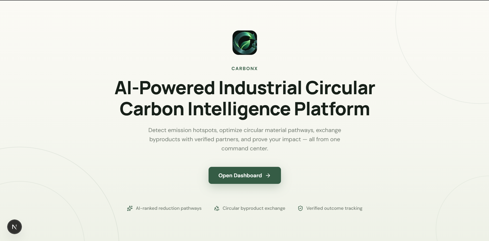
  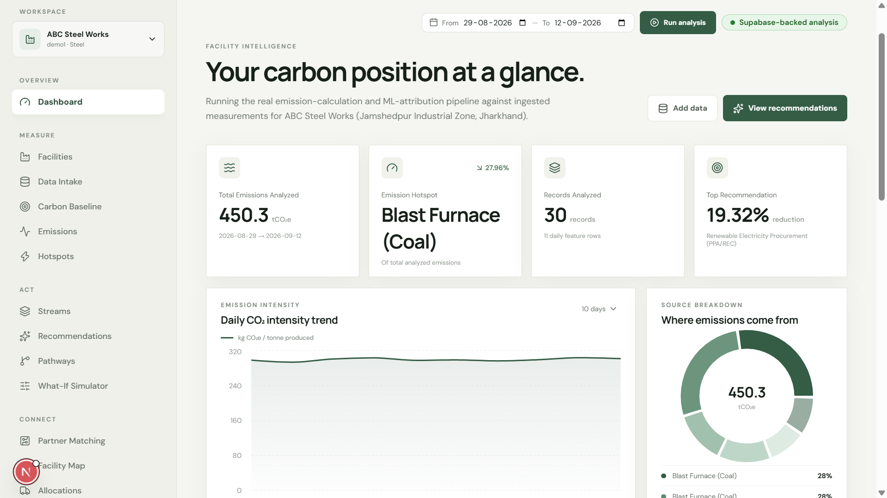
</p>

CarbonX helps industrial facilities measure emissions, find circular-economy opportunities for
their byproducts, match with off-take partners, and verify the impact of what they ship. It's a
FastAPI + PostgreSQL (Supabase) backend paired with a Next.js dashboard.

The codebase actually contains **two data models living side by side**:

1. **Circular economy suite** — byproduct streams, emission hotspots, off-taker partners,
   pathways, allocations, traceability/DPP, and verified outcomes for three demo facilities
   (Gujarat / Mumbai / Pune). Real tables in Supabase, but several dashboard aggregate endpoints
   currently return fixed demonstration numbers rather than computing from the DB (see
   [Known limitations](#known-limitations)).
2. **Dynamic measurement + analysis engine** — a metadata-driven platform (`metric_definitions` /
   `measurements`) with two real seeded factories (ABC Steel Works, XYZ Textile Mills) and a
   genuine 10-stage analysis pipeline: emission calculation → source-contribution analysis →
   feature engineering → ML attribution (Random Forest + SHAP) → root-cause interpretation →
   MCDA-ranked reduction recommendations. This is what the main Dashboard page now runs against.

## Repository structure

```
carbonX_hackout26/
├── .env                          # BACKEND_URL used by some tooling
├── backend/
│   ├── api/
│   │   ├── main.py               # FastAPI app: organizations, factories, metrics,
│   │   │                         #   measurement ingest, architecture-verification
│   │   └── routes/
│   │       ├── analysis_routes.py    # POST /factories/{id}/analyze + fast GET reads
│   │       ├── circular_routes.py    # streams, partners, pathways, allocations,
│   │       │                         #   traceability, evidence, verification
│   │       ├── dashboard_routes.py   # dashboard summary/trend/scope + hotspots + facilities
│   │       └── metadata_routes.py    # emission factors, data sources, org settings, simulator
│   ├── analysis/                 # the 10-stage pipeline
│   │   ├── pipeline.py               # orchestrates all stages
│   │   ├── emission_calculator.py    # activity × emission-factor → emission_records
│   │   ├── contribution_analyzer.py  # per-source contribution ranking
│   │   ├── feature_engineer.py       # daily engineered features (numpy/pandas)
│   │   ├── ml_attribution.py         # RandomForest + SHAP feature attribution
│   │   ├── impact_calculator.py      # alternative-intervention impact modeling
│   │   ├── alternatives_kb.py        # knowledge base of decarbonization alternatives
│   │   └── recommendation_engine.py  # MCDA ranking → top recommendation
│   ├── storage/ , storage_service.py # measurement ingest/storage service
│   ├── seed/, seed_demo_data.py      # seeds the 2 real factories + measurements
│   ├── seed_circular_data.py         # seeds the 3 circular-economy demo facilities
│   ├── migrate_circular.py           # creates the circular-economy tables
│   ├── schema.sql                    # full canonical multi-tenant schema
│   ├── tests/                        # pytest suite
│   └── requirements.txt
│
└── frontend/
    ├── app/
    │   ├── page.js                # standalone landing page ("/") — no sidebar chrome
    │   ├── layout.js               # root layout, wraps everything in AppShell
    │   ├── dashboard/page.js       # main dashboard — runs the real analysis pipeline
    │   ├── facilities/, facilities/[id]/     # circular-economy facility pages
    │   ├── facility-map/           # Leaflet map of facility/partner locations
    │   ├── hotspots/, hotspots/[id]/
    │   ├── streams/, streams/[id]/
    │   ├── partners/, pathways/, allocations/, matching/
    │   ├── traceability/, evidence/, verified-outcomes/, passports/
    │   ├── emission-factors/, data-sources/, data-intake/, settings/, simulator/
    │   ├── carbon-baseline/, emissions/, recommendations/
    │   └── globals.css
    ├── components/
    │   ├── shell/                 # AppShell, Sidebar (facility selector, nav), Topbar
    │   ├── charts/                 # Recharts wrappers (trend, donut, bar charts)
    │   ├── map/                    # FacilityLeafletMap (react-leaflet)
    │   └── ui/                     # MetricCard, Panel, StatusBadge, PageHeader, etc.
    ├── lib/
    │   ├── api-client.js           # REST client — every backend call, with demo-data fallback
    │   ├── FacilityContext.js      # global selected-factory state (persisted to localStorage)
    │   ├── demo-data/              # fallback datasets used when the backend is unreachable
    │   └── types.js
    ├── public/                     # static assets (image.png = brand mark)
    ├── package.json
    └── .env.local                  # NEXT_PUBLIC_API_URL
```

## Getting started

### 1. Backend

```bash
cd backend
pip install -r requirements.txt
```

Create `backend/.env` with your Supabase/Postgres credentials:

```
DATABASE_URL=postgresql://<user>:<password>@<host>:<port>/<db>
PROJECT_URL=...
PUBLISHABLE_KEY=...
```

Apply the schema and seed data (run once against a fresh database):

```bash
psql "$DATABASE_URL" -f schema.sql
python migrate_circular.py          # creates streams/hotspots/partners tables
python seed_circular_data.py        # seeds the 3 circular-economy demo facilities
python seed/seed_demo_data.py       # seeds the 2 real factories + measurements
```

Run the API:

```bash
python -m uvicorn api.main:app --reload --port 8000
```

The API is served at `http://127.0.0.1:8000/api/v1`, with interactive docs at
`http://127.0.0.1:8000/docs`.

### 2. Frontend

```bash
cd frontend
npm install
npm run dev
```

Open `http://localhost:3000`. It redirects nowhere by default — `/` is the landing page, and
`/dashboard` is the app. Set the API base in `frontend/.env.local` if the backend isn't on the
default host/port:

```
NEXT_PUBLIC_API_URL=http://127.0.0.1:8000/api/v1
```

If the backend is unreachable, every page falls back to bundled demo data
(`frontend/lib/demo-data/`) so the UI still renders.

## Key features

- **Landing page** (`/`) — marketing splash with a CTA into the dashboard.
- **Dashboard** (`/dashboard`) — pick a factory from the sidebar selector, choose a date range,
  and run the real analysis pipeline against Supabase-ingested measurements. Shows total
  emissions, ranked emission sources, a daily CO₂-intensity trend, MCDA-ranked reduction
  alternatives with real reasoning text, observed operational patterns, and model-quality metrics
  (R², sample count). A run takes 15–60s (genuine ML computation, not cached).
- **Facility selector** — global, persisted in `localStorage`, sourced from the real `/factories`
  endpoint.
- **Circular economy suite** — hotspots, byproduct streams, off-taker matching, pathways,
  allocations, traceability/Digital Product Passports, and verified outcomes, scoped by facility
  where the underlying tables support it (hotspots and streams do; others don't yet).
- **Facility map** (`/facility-map`) — real OpenStreetMap/Leaflet map with hardcoded facility and
  partner coordinates.

## API reference (by router)

| Router | Base | Highlights |
|---|---|---|
| `analysis_routes.py` | `/api/v1` | `POST /factories/{id}/analyze` (full pipeline), fast reads: `/factories/{id}/contribution`, `/features`, `/ml-attribution`, `/recommendations` |
| `dashboard_routes.py` | `/api/v1` | `/dashboard/summary`, `/emissions-trend`, `/scope-breakdown`, `/facility-comparison`, `/hotspots` (real, `facility_id`-filterable), `/facilities/overview` |
| `circular_routes.py` | `/api/v1` | `/streams`, `/partners`, `/pathways`, `/pathways/match`, `/allocations`, `/traceability/*`, `/evidence`, `/verification/*` |
| `metadata_routes.py` | `/api/v1` | `/emission-factors`, `/data-sources/status`, `/settings/organization`, `POST /simulator/project` |
| `api/main.py` | `/api/v1` | `/organizations`, `/factories`, `/factories/{id}/metrics`, `/factories/{id}/measurements(/batch)`, `/architecture/verification` |

## Known limitations

- Several `dashboard_routes.py` / `metadata_routes.py` endpoints (`emissions-trend`,
  `scope-breakdown`, `sources-breakdown`, `facilities/overview`, `facilities/{id}/processes`,
  `emission-factors`, `data-sources/status`, `settings/organization`) return fixed demonstration
  values rather than querying the database — real per-facility figures only exist for the two
  factories behind the analysis pipeline (ABC Steel Works, XYZ Textile Mills).
- The circular-economy facilities (Gujarat/Mumbai/Pune) and the two real analysis factories are
  **separate datasets** with no shared IDs — hotspots/streams pages will show "no data recorded"
  for the two real factories, and the dashboard's analysis pipeline has no circular-economy data
  for the three demo facilities.
- `emission_factors`/`shap`/`scikit-learn`/`numpy`/`pandas` must be installed for
  `POST /factories/{id}/analyze` to succeed — without them it 500s with `ModuleNotFoundError`.
- The `feature_values` table accumulates a new row per pipeline re-run (no upsert), so repeated
  `/analyze` calls for the same period create duplicate rows; the frontend deduplicates by
  averaging same-day values when charting.

## Tech stack

### Backend

| Layer | Technology | Purpose |
|---|---|---|
| Language | **Python 3.14** | |
| Web framework | **FastAPI** 0.141 | REST API, routing, request validation |
| ASGI server | **Uvicorn** 0.52 | Serves the FastAPI app |
| Database | **PostgreSQL** (hosted on **Supabase**) | Primary datastore, multi-tenant schema |
| DB driver | **psycopg2-binary** 2.9 | Raw SQL access from Python |
| Validation | **Pydantic** 2.13 | Request/response models |
| Config | **python-dotenv** 1.2 | Loads `.env` credentials |
| Data processing | **pandas** 3.0, **NumPy** 2.5 | Feature engineering over measurement time series |
| Machine learning | **scikit-learn** 1.9 (`RandomForestRegressor`) | Emission-driver attribution model |
| Explainability | **SHAP** 0.52 | Feature-importance attribution (TreeExplainer) |
| Testing | **FastAPI `TestClient`** / **httpx** | API endpoint tests (`backend/tests/`) |

### Frontend

| Layer | Technology | Purpose |
|---|---|---|
| Framework | **Next.js 16** (App Router, Turbopack) | Routing, SSR/CSR, dev server, build |
| UI library | **React 19** | Component model |
| Styling | **Tailwind CSS 4** (`@tailwindcss/postcss`) | Utility-first styling |
| Component primitives | **Radix UI** (`react-dialog`, `react-select`, `react-slider`, `react-tabs`, `react-tooltip`) | Accessible unstyled UI primitives |
| Styling utilities | **class-variance-authority**, **clsx**, **tailwind-merge** | Conditional/merged className composition |
| Charts | **Recharts 3** | Trend, donut, and bar charts on the dashboard |
| Maps | **Leaflet 1.9** + **react-leaflet 5** + **OpenStreetMap** tiles | Real geographic facility/partner map |
| Icons | **lucide-react** | Icon set used throughout the UI |
| Fonts | **Geist / Geist Mono** (via `next/font`) | App typography |
| Linting | **ESLint 9** + **eslint-config-next** | Code quality checks (`npm run lint`) |

### Infrastructure / tooling

| Technology | Purpose |
|---|---|
| **Supabase** | Managed Postgres + connection pooling for the database |
| **npm** | Frontend package management |
| **pip** | Backend package management (`requirements.txt`) |
| **Git** | Version control |

## Screenshots

### 1. Facilities

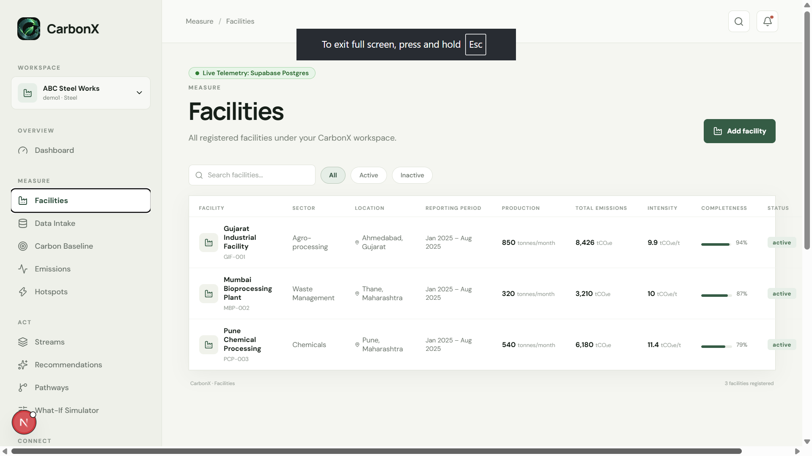

### 2. Data Intake & Ingestion

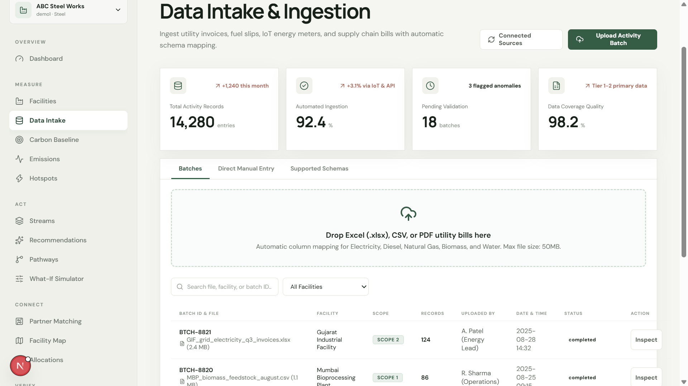

### 3. Carbon Baseline & Science-Based Targets

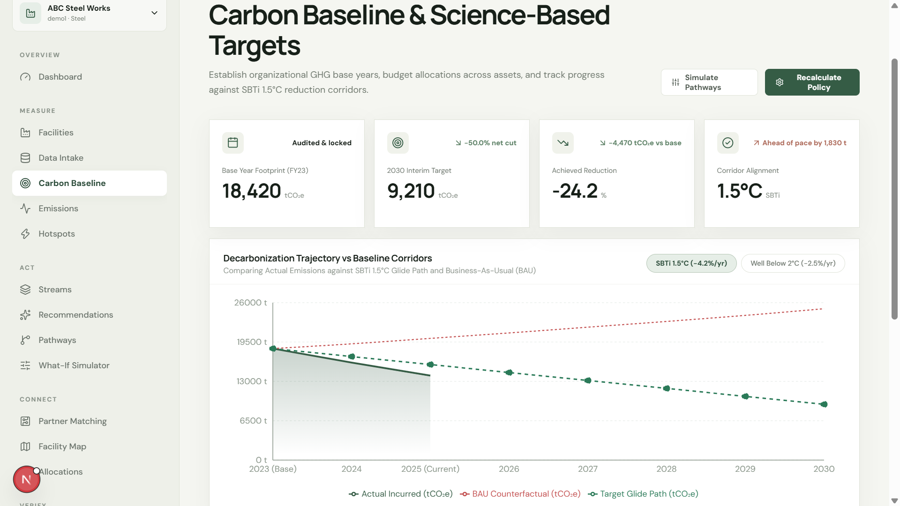

### 4. Emissions Accounting Ledger

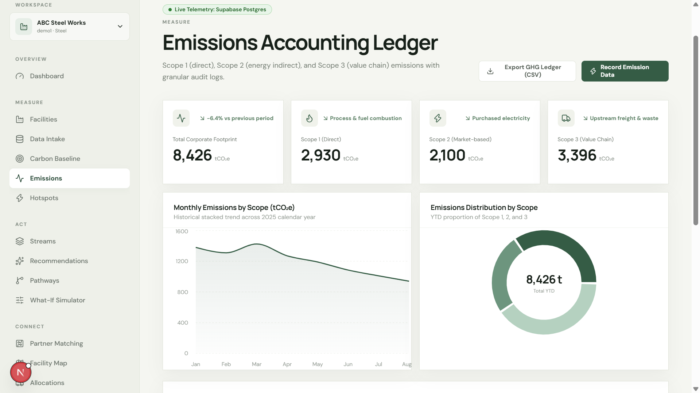

### 5. Hotspot Explorer

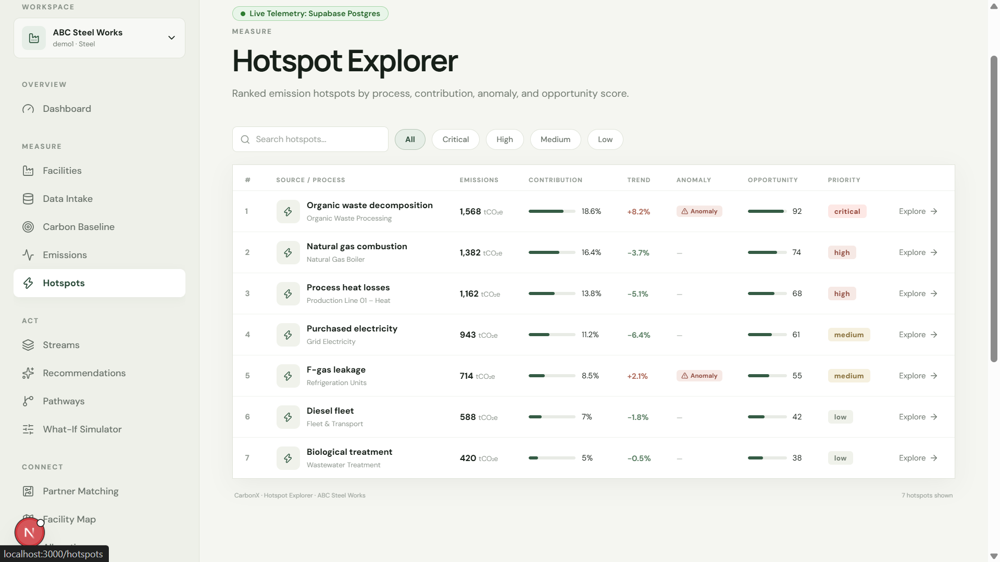

### 6. Industrial Symbiosis & Partner Matching

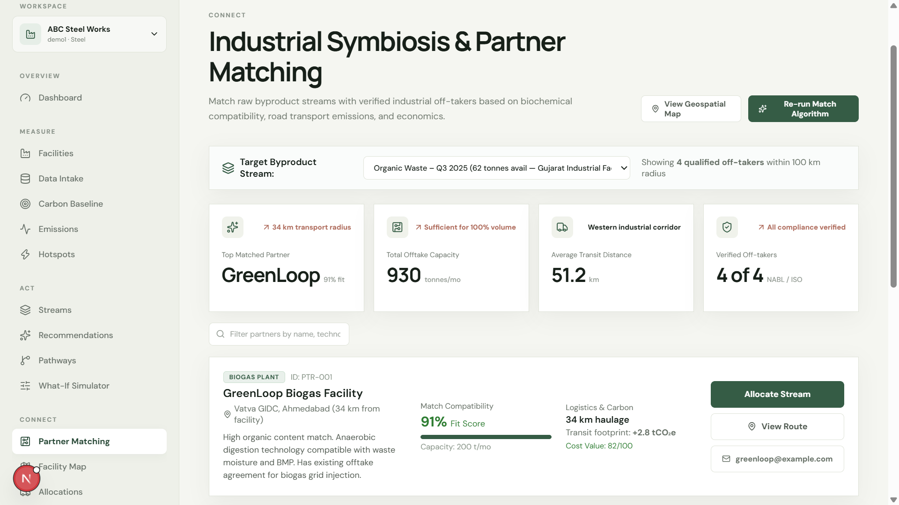

### 7. Geospatial Network & Transit Corridors

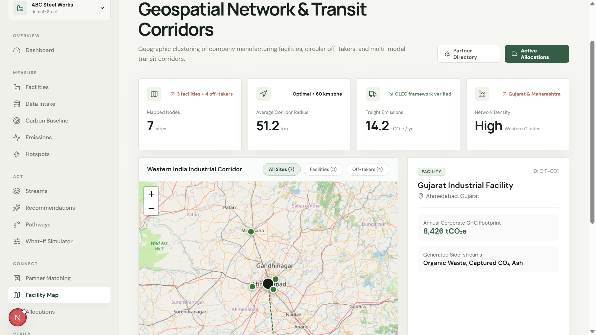

### 8. Stream Allocations & Offtake Contracts

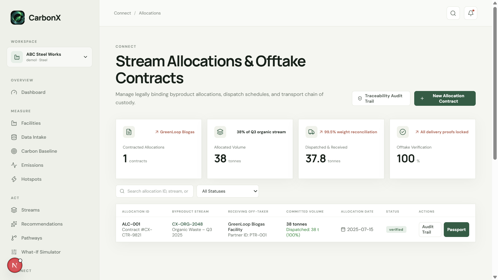

### 9. Digital Product & Byproduct Passports (DPP)

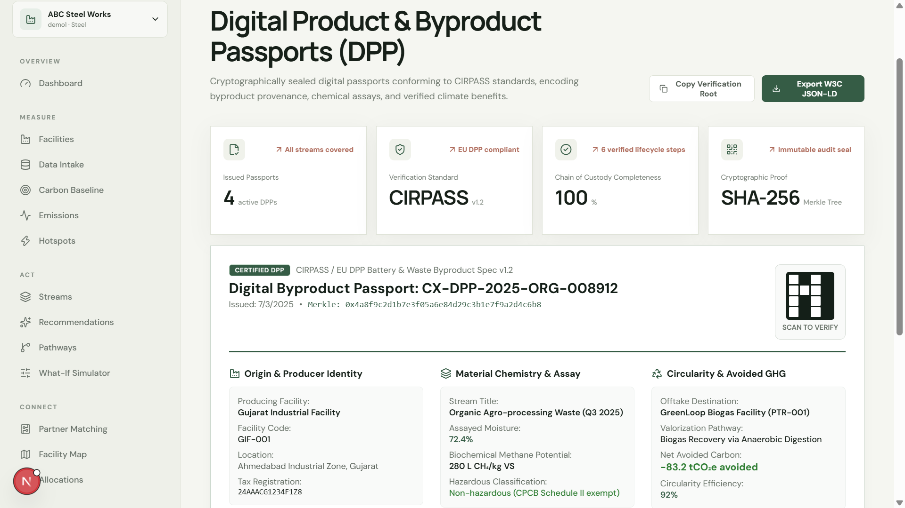

### 10. Byproduct Lifecycle Traceability & Audit Trail

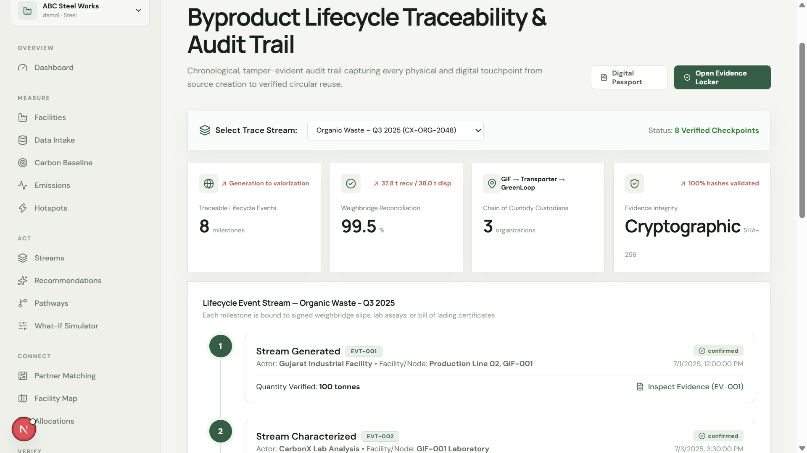

### 11. Evidence Locker & Chain of Custody Proofs

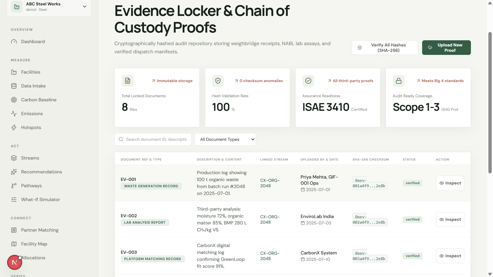

### 12. Verified Outcomes & Avoidance Assurance

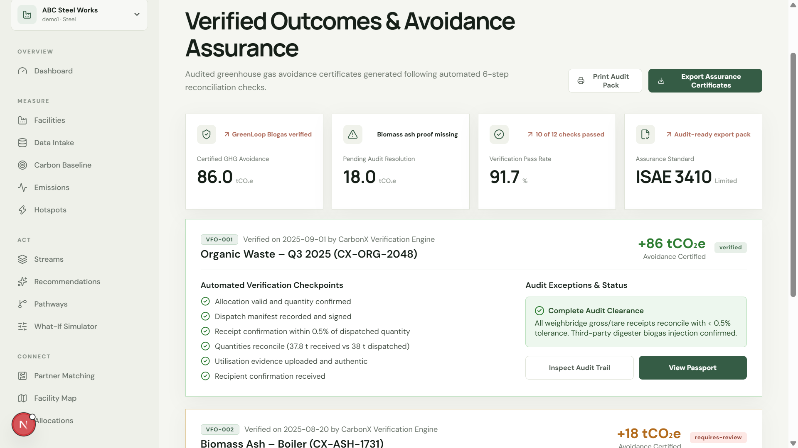

### 13. Emission Factor Database

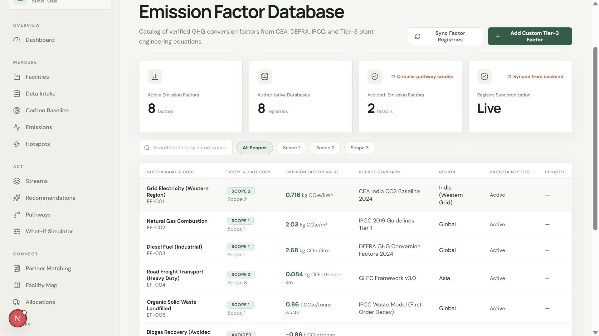

### 14. Circular Partners & Off-takers Directory

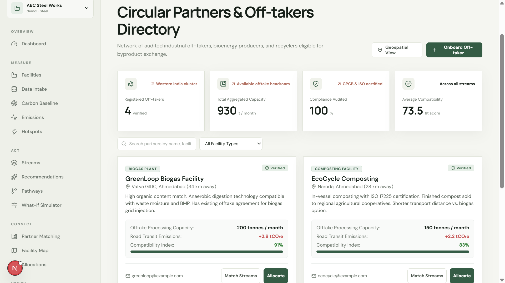

### 15. Automated Data Sources & Telemetry

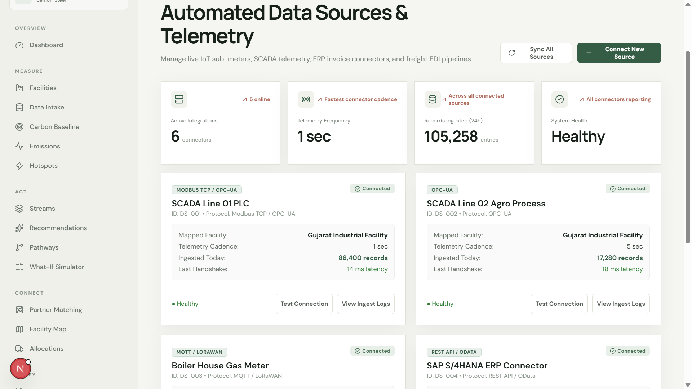

### 16. Platform & Workspace Settings

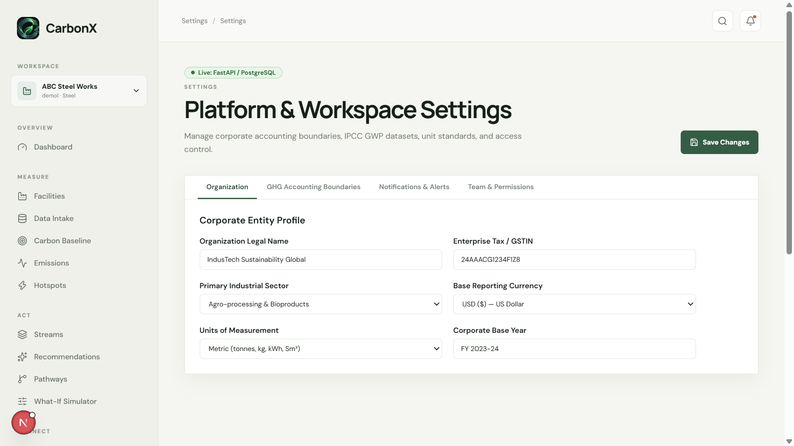
