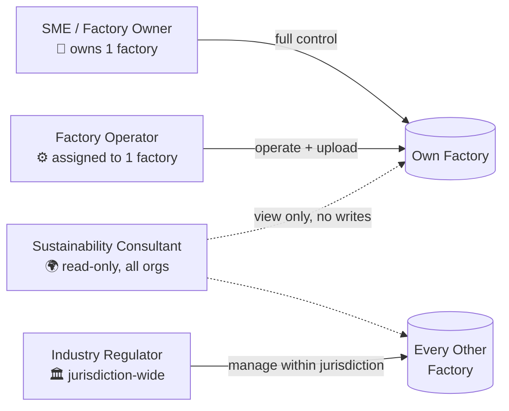
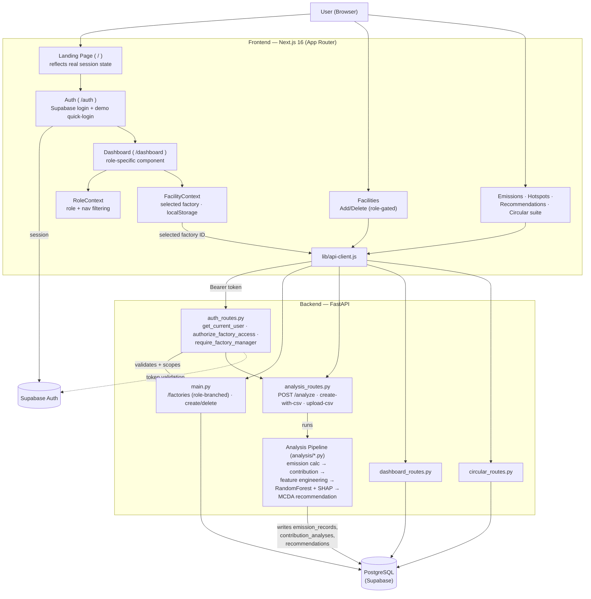

<div align="center">

# 🌱 CARBONX 🌏

### Supporting docs links : 

### PPT : https://canva.link/twxopnxxodjguqj ✅
### demo Link (Google drive) : https://drive.google.com/file/d/1KhX31cQA3qCsH8bLnrL-Lx2ouMx82lYY/view?usp=drivesdk ✅
### demo link (Youtube) : https://youtu.be/37bJZ1a1kyY?si=SnMicBOz9NF1_9Ln✅


### *AI-Powered Industrial Circular Carbon Intelligence Platform*

[](https://python.org)
[](https://fastapi.tiangolo.com)
[](https://nextjs.org)
[](https://react.dev)
[](https://supabase.com)
[](https://scikit-learn.org)
[](#-analysis-pipeline-deep-dive)
[](https://tailwindcss.com)

---

*CarbonX watches a factory's real operational data, calculates its emissions, explains **why** they look the way they do with a genuine Random Forest + SHAP model, and ranks real decarbonization options with a multi-criteria decision engine — all gated behind four purpose-built user roles, each with a different scope of visibility and privilege.*

</div>

---

## 📋 Table of Contents

- [What CarbonX Does](#-what-carbonx-does)
- [The Three Pillars](#-the-three-pillars)
- [Role-Based Access Control](#-role-based-access-control)
- [System Architecture](#-system-architecture)
- [Key Features](#-key-features)
- [Tech Stack](#-tech-stack)
- [Repository Structure](#-repository-structure)
- [Getting Started](#-getting-started)
- [Demo Walkthrough](#-demo-walkthrough)
- [Analysis Pipeline Deep Dive](#-analysis-pipeline-deep-dive)
- [API Reference](#-api-reference)
- [Known Limitations](#-known-limitations)
- [Testing](#-testing)
- [Screenshots](#-screenshots)

---

## 🔍 What CarbonX Does

Manufacturing facilities need to know **what** they emit, **why**, and **what to do about it** — but most sustainability tooling stops at reporting. CarbonX goes further: it's a genuine 10-stage pipeline that turns raw meter/fuel/production readings into a ranked, explainable decarbonization plan, wrapped in a multi-tenant platform where an SME owner, their floor staff, an external consultant, and a government regulator can all use the *same* data with completely different scopes and privileges.

The codebase contains **two data models living side by side**:

| Model | What it is | Status |
|---|---|---|
| **Dynamic measurement + analysis engine** | Metadata-driven (`metric_definitions` / `measurements`) with real factories, a real 10-stage pipeline, and full RBAC. This is what the Dashboard, Facilities, Emissions, Hotspots, and Recommendations pages run against. | ✅ **Live** |
| **Circular-economy suite** | Byproduct streams, off-taker partners, pathways, allocations, traceability/DPP, verified outcomes — real Supabase tables with real CRUD, but a separate historical demo dataset (Gujarat/Mumbai/Pune) not yet linked to the real factories above. | ⚠️ Partially wired — see [Known Limitations](#-known-limitations) |

---

## 🧭 The Three Pillars

```
┌───────────────────────────────────────────────────────────────────┐
│                         CARBONX PLATFORM                          │
├───────────────────┬───────────────────────┬───────────────────────┤
│    📥 MEASURE      │     🧠 ATTRIBUTE       │      ⚡ ACT            │
│                    │                       │                       │
│ • CSV / Manual     │ • Emission Calculator │ • MCDA Recommendation │
│   Ingestion        │   (Activity × Factor) │   Engine (weighted)   │
│ • Dynamic Metric   │ • Contribution        │ • Alternatives KB     │
│   Auto-Discovery   │   Analyzer (ranking)  │ • Impact Calculator   │
│ • Multi-Factory    │ • Feature Engineering │ • Root-Cause          │
│   Data Model       │   (pandas/NumPy)      │   Interpretation      │
│                    │ • Random Forest + SHAP│                       │
│                    │   (explainable ML)    │                       │
└───────────────────┴───────────────────────┴───────────────────────┘
```

---

## 🔐 Role-Based Access Control

Every screen and every backend endpoint is scoped to **one of four roles**, seeded via Supabase Auth + a Postgres `user_organization_roles` table. This isn't UI-only — factory management endpoints (`POST /factories/create-with-csv`, `DELETE /factories/{id}`) validate the caller's role and organization/jurisdiction on the backend before touching the database.



| Role | Factory Scope | Org Scope | Can Add/Delete Factory | Can Upload Data | Primary View |
|---|---|---|---|---|---|
| 👑 **SME / Factory Owner** | Own factory (capped at **1**) | Own organization | ✅ | ✅ | Full KPI dashboard, hotspots, ranked recommendations |
| ⚙️ **Factory Operator** | Assigned factory only (capped at **1**) | Own organization | ✅ (own factory only) | ✅ (own factory only) | Stripped-down operational "what needs attention" view |
| 🌍 **Sustainability Consultant** | **Every factory, every organization** | All (unconditional) | ❌ — monitor/analyze only | ❌ | Comparative analysis, pathway scoring, scenario tools |
| 🏛️ **Industry Regulator** | Every factory whose org matches their granted **jurisdiction** | Jurisdiction-matched orgs | ✅ (within jurisdiction) | ✅ | Compliance-framed monitoring dashboard |

> Demo credentials for all four roles are in the [Demo Walkthrough](#-demo-walkthrough) section below.

---

## 🏗️ System Architecture



- **Every factory-scoped backend call validates the caller's role, organization, and (for regulators) jurisdiction** via `authorize_factory_access()` / `require_factory_manager()` in `auth_routes.py` — not just the frontend nav.
- **Sessions persist correctly across navigation** — the landing page checks real Supabase session state instead of always showing a logged-out marketing view, and logout only happens by explicit user action.
- **`POST /factories/{id}/analyze` is the only endpoint that computes rather than reads** — a genuine 15–135s pipeline run (emission calculation → SHAP attribution → MCDA ranking) that writes its results back to Postgres.

---

## ✨ Key Features

### 🔐 Multi-Role Access Control
- Four distinct roles with real backend enforcement, not just hidden UI
- Single-factory cap for SME Owner / Factory Operator, enforced at creation time
- Jurisdiction-based visibility for regulators (matches organization `country`)
- Consultants get full cross-organization read access with zero write/delete privileges

### 🏭 Facility Management
- **Add Factory** — name it, pick an industry type, upload its first CSV, all in one step
- **Delete Factory** — ordered cascade delete respecting every FK constraint in the schema
- Conflict-aware UX: hitting the one-factory cap offers a "delete existing & add new" flow instead of a dead end

### 🧠 Real Analysis Pipeline
- **Emission Calculator** — `Activity × Emission Factor = Emission Value`, stored as immutable records
- **Contribution Analyzer** — ranks emission sources by percentage share, identifies the primary hotspot
- **ML Attribution** — genuine `RandomForestRegressor` + `shap.TreeExplainer`, self-flags results as illustrative below 30 daily samples
- **MCDA Recommendation Engine** — weighted-sum ranking (emission reduction 50% / cost-effectiveness 20% / feasibility 20% / compatibility 10% by default) over a real alternatives knowledge base

### 📊 Role-Specific Dashboards
- SME Owner / Consultant → full KPI suite, trend charts, ranked sources, MCDA alternatives
- Factory Operator → stripped-down "what needs attention now" operational view
- Regulator → compliance-framed authorized-facility monitoring

### 🎨 Platform Polish
- App-wide footer, sticky to the bottom of the viewport even on short pages
- Account menu with avatar, role, and explicit logout — no surprise session expiry
- CSV upload flow that lets you name the factory and see it appear immediately in the sidebar/facility directory

---

## 🛠️ Tech Stack

### Backend

| Layer | Technology | Purpose |
|---|---|---|
| Language | **Python 3.14** | |
| Web framework | **FastAPI** | REST API, routing, request validation |
| ASGI server | **Uvicorn** | Serves the FastAPI app |
| Database | **PostgreSQL** (hosted on **Supabase**) | Primary datastore, multi-tenant schema |
| Auth | **Supabase Auth** | JWT-based sessions, validated server-side per request |
| DB driver | **psycopg2-binary** | Raw SQL access from Python |
| Validation | **Pydantic** | Request/response models |
| Data processing | **pandas**, **NumPy** | Feature engineering over measurement time series |
| Machine learning | **scikit-learn** (`RandomForestRegressor`) | Emission-driver attribution model |
| Explainability | **SHAP** | Feature-importance attribution (TreeExplainer) |
| Testing | **FastAPI `TestClient`** / **httpx** | API endpoint tests (`backend/tests/`) |

### Frontend

| Layer | Technology | Purpose |
|---|---|---|
| Framework | **Next.js 16** (App Router, Turbopack) | Routing, SSR/CSR, dev server, build |
| UI library | **React 19** | Component model |
| Styling | **Tailwind CSS 4** | Utility-first styling |
| Auth client | **@supabase/supabase-js** | Session management, `onAuthStateChange` |
| Component primitives | **Radix UI** | Accessible unstyled UI primitives |
| Charts | **Recharts 3** | Trend, donut, and bar charts on the dashboard |
| Maps | **Leaflet** + **react-leaflet** + **OpenStreetMap** | Geographic facility/partner map |
| Icons | **lucide-react** | Icon set used throughout the UI |
| Fonts | **Geist / Geist Mono** (via `next/font`) | App typography |

### Infrastructure

| Technology | Purpose |
|---|---|
| **Supabase** | Managed Postgres + connection pooling + Auth |
| **npm** | Frontend package management |
| **pip** | Backend package management (`requirements.txt`) |
| **Git** | Version control |

---

## 📁 Repository Structure

```
carbonX_hackout26/
├── backend/
│   ├── api/
│   │   ├── main.py                   # organizations, factories (role-branched list/create/delete),
│   │   │                             #   metrics, measurement ingest
│   │   └── routes/
│   │       ├── auth_routes.py            # get_current_user · authorize_factory_access ·
│   │       │                             #   require_factory_manager · role/permission tables
│   │       ├── analysis_routes.py        # POST /analyze · create-with-csv · upload-csv · fast GET reads
│   │       ├── circular_routes.py        # streams, partners, pathways, allocations,
│   │       │                             #   traceability, evidence, verification
│   │       ├── dashboard_routes.py       # dashboard summary/trend/scope + hotspots
│   │       └── metadata_routes.py        # emission factors, data sources, org settings, simulator
│   ├── analysis/                     # the 10-stage pipeline
│   │   ├── pipeline.py                   # orchestrates all stages
│   │   ├── emission_calculator.py        # activity × emission-factor → emission_records
│   │   ├── contribution_analyzer.py      # per-source contribution ranking
│   │   ├── feature_engineer.py           # daily engineered features (numpy/pandas)
│   │   ├── ml_attribution.py             # RandomForest + SHAP feature attribution
│   │   ├── impact_calculator.py          # alternative-intervention impact modeling
│   │   ├── alternatives_kb.py            # knowledge base of decarbonization alternatives
│   │   └── recommendation_engine.py      # MCDA ranking → top recommendation
│   ├── ingest_custom_csv.py          # CSV parser (WIDE/LONG) + factory bootstrap + pipeline trigger
│   ├── storage_service.py            # measurement ingest/storage service, validation, quality flags
│   ├── seed_users.py                 # demo account role/org/jurisdiction seeding
│   ├── seed/, seed_demo_data.py      # seeds the real factories + measurements
│   ├── seed_circular_data.py         # seeds the circular-economy demo facilities
│   ├── 002_auth_rbac.sql             # roles, permissions, role_permissions seed
│   ├── 003_rbac_enforcement.sql      # RLS policies + fn_user_has_permission (SQL-level, informational)
│   ├── 004_scope_hierarchy.sql       # jurisdiction-based regulator scoping
│   ├── schema.sql                    # full canonical multi-tenant schema
│   ├── tests/                        # pytest suite
│   └── requirements.txt
│
└── frontend/
    ├── app/
    │   ├── page.js                # landing page — reflects real session state
    │   ├── auth/page.js           # login/signup + demo quick-login
    │   ├── layout.js              # root layout, wraps everything in AppShell
    │   ├── dashboard/page.js      # role-branched dashboard (Owner/Consultant · Operator · Regulator)
    │   ├── facilities/            # Add/Delete factory UI, role-gated
    │   ├── data-intake/           # measurement table + upload entry point
    │   ├── emissions/, hotspots/, recommendations/
    │   ├── streams/, matching/, pathways/, simulator/, allocations/
    │   ├── passports/, traceability/, evidence/, verified-outcomes/
    │   ├── emission-factors/, data-sources/, partners/, settings/, carbon-baseline/
    │   └── globals.css
    ├── components/
    │   ├── shell/              # AppShell, Sidebar, Topbar, UserMenu, Footer
    │   ├── charts/              # Recharts wrappers
    │   ├── map/                 # FacilityLeafletMap (react-leaflet)
    │   └── ui/                  # MetricCard, Panel, StatusBadge, PageHeader, etc.
    ├── lib/
    │   ├── api-client.js        # REST client — every backend call
    │   ├── RoleContext.js       # role resolution + per-role nav lists
    │   ├── FacilityContext.js   # global selected-factory state
    │   ├── supabase-browser.js  # Supabase client singleton
    │   └── demo-data/           # fallback datasets for the circular-economy suite
    ├── public/                  # static assets (logo, etc.)
    └── package.json
```

---

## 🚀 Getting Started

### 1. Backend

```bash
cd backend
pip install -r requirements.txt
```

Create `backend/.env` with your Supabase project credentials:

```
DATABASE_URL=postgresql://<user>:<password>@<pooler-host>:6543/postgres
PROJECT_URL=https://<project-ref>.supabase.co
PUBLISHABLE_KEY=sb_publishable_...
SERVICE_ROLE_KEY=...    # optional — enables seed_users.py to create real Supabase Auth accounts
```

> ⚠️ Use the **connection pooler** host for `DATABASE_URL` (`aws-0-<region>.pooler.supabase.com:6543`), not the direct `db.<ref>.supabase.co` host — many environments can't resolve the direct host's IPv6-only address.

Apply the schema, RBAC migrations, and seed data (run once against a fresh database):

```bash
psql "$DATABASE_URL" -f schema.sql
psql "$DATABASE_URL" -f 002_auth_rbac.sql
psql "$DATABASE_URL" -f 003_rbac_enforcement.sql
psql "$DATABASE_URL" -f 004_scope_hierarchy.sql
python migrate_circular.py          # creates streams/hotspots/partners tables
python seed_circular_data.py        # seeds the circular-economy demo facilities
python seed/seed_demo_data.py       # seeds the real factories + measurements
python seed_users.py                # creates the 4 demo role accounts
```

Run the API:

```bash
python -m uvicorn api.main:app --reload --port 8000
```

Served at `http://127.0.0.1:8000/api/v1`, interactive docs at `http://127.0.0.1:8000/docs`.

### 2. Frontend

```bash
cd frontend
npm install
npm run dev
```

Open `http://localhost:3000` — `/` is the landing page, `/auth` is login/signup, `/dashboard` is the app. Set the API base in `frontend/.env.local`:

```
NEXT_PUBLIC_API_URL=http://127.0.0.1:8000/api/v1
NEXT_PUBLIC_SUPABASE_URL=https://<project-ref>.supabase.co
NEXT_PUBLIC_SUPABASE_PUBLISHABLE_KEY=sb_publishable_...
```

---

## 🎮 Demo Walkthrough

> Use the **"Try with Demo Account (Quick Login)"** button on `/auth` and pick a role card — no need to type credentials.

| Role | Email | Password | Lands In |
|---|---|---|---|
| 👑 SME / Factory Owner | `sme_owner@carbonx.demo` | `CarbonX@Demo123` | Full dashboard for their one factory |
| ⚙️ Factory Operator | `factory_operator@carbonx.demo` | `CarbonX@Demo123` | Operational view for their assigned factory |
| 🌍 Sustainability Consultant | `sustainability_consultant@carbonx.demo` | `CarbonX@Demo123` | Read-only view across every factory/org |
| 🏛️ Industry Regulator | `industry_regulator@carbonx.demo` | `CarbonX@Demo123` | Compliance dashboard for their jurisdiction |

**Suggested flow:** log in as **SME Owner** → run the analysis pipeline on the dashboard → inspect Hotspots and Recommendations → visit Facilities and try adding a second factory (watch the one-factory cap kick in) → log out → log in as **Factory Operator** to see the same underlying data through a stripped-down operational lens → log in as **Consultant** to see every factory across every org with zero management controls → log in as **Regulator** to see jurisdiction-based access in action.

---

## 🧠 Analysis Pipeline Deep Dive

### The 10 Stages (`analysis/pipeline.py`)

```
1. Factory metadata            6. ML attribution (RandomForest + SHAP)
2. Bootstrap sources/factors   7. Root-cause interpretation
3. Emission calculation        8. Applicable alternatives
4. Source contribution         9. Impact calculation
5. Feature engineering        10. MCDA ranking → recommendation
```

### Emission Factors (demonstration values, `emission_calculator.py`)

| Metric column | Factor | Emission Source |
|---|---|---|
| `Coal Consumption` | 2.4 kg CO₂ / kg coal | Blast Furnace (Coal) |
| `Natural Gas` | 2.0 kg CO₂ / m³ gas | Boiler (Natural Gas) |
| `Electricity` | 0.7 kg CO₂ / kWh | Electricity Consumption |

> Only columns named exactly `Coal Consumption`, `Natural Gas`, or `Electricity` produce emission records — any other ingested metric (Production, Diesel, Operating Hours, Furnace Temperature, etc.) is still stored and used as an ML feature, just not directly converted to CO₂.

### ML Attribution (`analysis/ml_attribution.py`)

```
Daily Feature Matrix (one row per calendar day)
          │
          ▼
   RandomForestRegressor(n_estimators=50, max_depth=3)
          │
          ▼
   shap.TreeExplainer(rf).shap_values(X)
          │
          ▼
   Ranked feature importance (%) + R² / MAE
   ⚠ self-flags "DEMO ONLY" below 30 daily samples
```

### MCDA Recommendation Engine (`recommendation_engine.py`)

Default weights — min-max normalized, then weighted-summed per alternative:

```
score = 0.50 × emission_reduction + 0.20 × cost_effectiveness
      + 0.20 × feasibility        + 0.10 × compatibility
```

> A second, independently-weighted MCDA implementation exists inside `circular_routes.py` for byproduct-stream/pathway matching (`co2_benefit 35% / circularity 25% / economic_value 20% / logistics 20%`) — a different model for a different feature, not shared code.

---

## 📡 API Reference

| Router | Base | Highlights |
|---|---|---|
| `auth_routes.py` | `/api/v1/auth` | `/me`, `/scopes`, `/permissions`, `/organizations/{id}/members` |
| `main.py` | `/api/v1` | `/factories` (role-branched), `POST /factories`, `DELETE /factories/{id}`, `/factories/{id}/measurements(/batch)` |
| `analysis_routes.py` | `/api/v1` | `POST /factories/{id}/analyze` (full pipeline), `POST /factories/create-with-csv`, `POST /factories/{id}/upload-csv`, fast reads: `/contribution`, `/features`, `/ml-attribution`, `/recommendations` |
| `dashboard_routes.py` | `/api/v1` | `/dashboard/summary`, `/emissions-trend`, `/scope-breakdown`, `/hotspots` (real, `facility_id`-filterable) |
| `circular_routes.py` | `/api/v1` | `/streams`, `/partners`, `/pathways`, `/pathways/match`, `/allocations`, `/traceability/*`, `/evidence`, `/verification/*` |
| `metadata_routes.py` | `/api/v1` | `/emission-factors`, `/data-sources/status`, `/settings/organization`, `POST /simulator/project` |

---

## ⚠️ Known Limitations

- Several `dashboard_routes.py` / `metadata_routes.py` endpoints (`emissions-trend`, `scope-breakdown`, `sources-breakdown`, `facilities/overview`, `emission-factors`, `data-sources/status`, `settings/organization`) return fixed demonstration values rather than querying the database.
- The circular-economy demo facilities (Gujarat/Mumbai/Pune) and the real analysis factories are **separate datasets** with no shared IDs — several circular-economy pages (Streams, Matching, Partners, Allocations, Passports, Traceability, Evidence, Verified Outcomes) read/write real rows in real tables, but the headline KPI numbers shown above those tables are still hardcoded, and a few action buttons (Register Stream, Re-run Match, Add Custom Factor, Save Settings, etc.) aren't yet wired to their otherwise-working backend endpoints.
- `shap` / `scikit-learn` / `numpy` / `pandas` must be installed for `POST /factories/{id}/analyze` to succeed.
- Feature engineering aggregates measurements to **one row per calendar day** — multiple same-day readings for a metric overwrite rather than average, so intraday granularity doesn't increase the ML training sample count (only the date range does).
- Backend authorization on core factory/analysis endpoints only activates when a bearer token is present — a request with no `Authorization` header falls through to a legacy open path (kept for the test suite and offline demo fallback). The circular-economy route files (`circular_routes.py`, `dashboard_routes.py`, `metadata_routes.py`) currently have no auth dependency on any endpoint.

---

## 🧪 Testing

```bash
cd backend
python -m pytest tests/ -v
```

| Test file | Covers |
|---|---|
| `test_api.py` | Health check, factory listing, metrics, measurements, architecture verification |
| `test_storage.py` | Measurement ingestion, validation, quality flags |

---

## 📸 Screenshots

<p align="center">
  
  
</p>

| # | Screen |
|:---:|---|
| 1 |  Facilities |
| 2 |  Data Intake & Ingestion |
| 3 |  Carbon Baseline & Science-Based Targets |
| 4 |  Emissions Accounting Ledger |
| 5 |  Hotspot Explorer |
| 6 |  Industrial Symbiosis & Partner Matching |
| 7 |  Geospatial Network & Transit Corridors |
| 8 |  Stream Allocations & Offtake Contracts |
| 9 |  Digital Product & Byproduct Passports (DPP) |
| 10 |  Byproduct Lifecycle Traceability & Audit Trail |
| 11 |  Evidence Locker & Chain of Custody Proofs |
| 12 |  Verified Outcomes & Avoidance Assurance |
| 13 |  Emission Factor Database |
| 14 |  Circular Partners & Off-takers Directory |
| 15 |  Automated Data Sources & Telemetry |
| 16 |  Platform & Workspace Settings |

---

<div align="center">

**CarbonX · Detect. Optimize. Exchange. Verify.**

</div>
